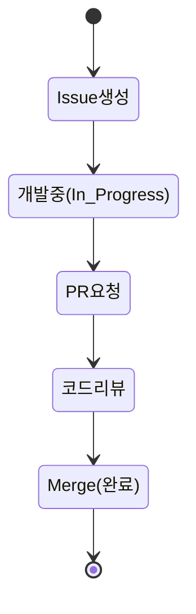

> **"Code is our Sword, Logic is our Shield."**
> 우리는 더 나은 소프트웨어 세상을 만들기 위해 모인 개발 크루입니다.

---

## 🛠 Tech Stack

![JAVA] ![SPRING-BOOT] ![NEXT] ![POSTGRESQL]

[JAVA]: https://img.shields.io/badge/Java-17+-orange?logo=openjdk
[SPRING-BOOT]: https://img.shields.io/badge/Spring%20Boot-3.x-6DB33F?logo=springboot
[NEXT]: https://img.shields.io/badge/Next.js-16.x-000000?logo=next.js
[POSTGRESQL]: https://img.shields.io/badge/PostgreSQL-17.x-4169E1?logo=postgresql

---

## 🏗 System Architecture

| Component | Repository | Technology |
| :--- | :--- | :--- |
| **Frontend** | [front-app-next](링크) | Next.js, TypeScript |
| **Backend** | [backend-api-server](링크) | Java, Spring Boot |
| **Database** | [database-app-postgresql](링크) | PostgreSQL |
| **Infra** | [os-docker](링크) | Docker Compose |

---

## 🚀 Projects
👉 [**전체 개발 로드맵 & 칸반 보드 보러가기**](https://github.com/orgs/knights-of-round/projects/9)

### 🔄 Workflow Process

---

## 💬 Community Discussions

> 조직 공용 질문, 아이디어, 공지는 아래 Discussions에서 진행합니다.
> 💡 **함께 고민하고 토론하는 공간입니다.** 아이디어 제안이나 질문은 언제든 환영합니다!

| Category | Description | Link |
| :--- | :--- | :---: |
| **📢 공지사항** | 팀 전체 필독 사항 및 업데이트 뉴스 | [바로가기](https://github.com/orgs/knights-of-round/discussions/categories/announcements) |
| **💡 아이디어** | 프로젝트의 방향성, 새로운 기능 제안 | [바로가기](https://github.com/orgs/knights-of-round/discussions/categories/ideas) |
| **🙏 Q&A** | 개발 중 막히는 부분, 기술적인 질문 | [바로가기](https://github.com/orgs/knights-of-round/discussions/categories/q-a) |

#### 🔥 Hot Topic
- [**.github organization 화면 구성 완전 좋아!!**](https://github.com/orgs/knights-of-round/discussions/1) (👈 방금 올리신 글 링크를 여기에 넣으세요)
- [Docker 컨테이너 메모리 최적화 방안 공유]((링크))
